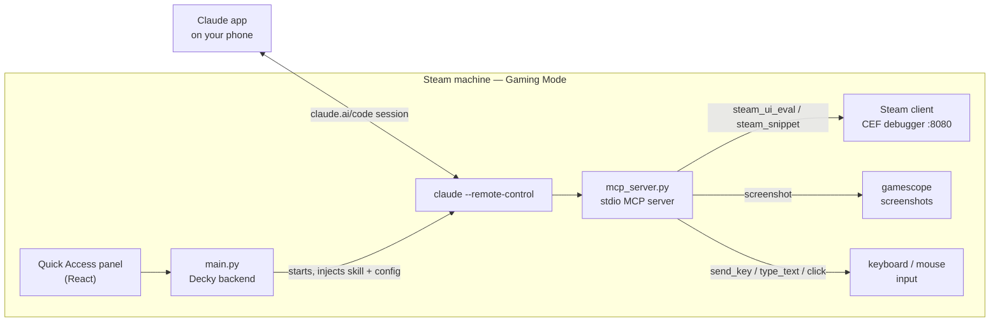

<div align="center">


# decky-claude

**Claude Code on your Steam machine, controlled from your phone — built to debug Steam without leaving Gaming Mode.**

[](https://github.com/TuxLux40/decky-claude/releases/latest)
[](https://github.com/TuxLux40/decky-claude/actions/workflows/release.yml)
[](https://decky.xyz/)
[](LICENSE)

[Install](#installation) · [How it works](#how-it-works) · [Usage](#usage) · [Roadmap](#roadmap)

</div>

---

Tap **Start Remote Session** in the Quick Access menu, open the link in the Claude app on your phone, and Claude is on your machine: it inspects the Steam client from the inside, reads logs, looks at your screen and presses buttons — while you watch from the couch.

## What it does

| | |
|---|---|
| **Phone-controlled Claude Code** | The plugin starts `claude --remote-control` in a working directory you pick and shows the session link. Open it in the Claude app and drive the session from your phone. |
| **Steam UI debugger** | Steam's Gaming Mode UI is embedded Chromium with a DevTools debugger on `localhost:8080`. Claude runs JavaScript inside it (`steam_ui_eval`), reads real client state — downloads, library, login, settings — and triggers real actions instead of hunting for pixels. |
| **Eyes and hands** | `screenshot` shows Claude what's on screen; `send_key`, `type_text` and `mouse_move_click` press keys and click. |
| **Always-loaded debugging skill** | The [steam-debugger skill](https://github.com/TuxLux40/skills) (workflow, log locations, safe-fix rules, per-topic references) is injected into every session's system prompt — on start and on resume. |
| **Keeps itself up to date** | Checks GitHub for new releases and installs them through Decky's own installer. |

In-game help (asking Claude about the game you're playing) uses the same tools; the tooling is tuned for Steam debugging.

> [!NOTE]
> **Gaming Mode only.** Screen capture goes through gamescope — the same capture the controller's screenshot button uses. There is deliberately no desktop fallback: gamescope has no Wayland screencopy protocol, and each desktop would need its own capture path. In Desktop Mode the session still works; `screenshot` and input just report that they need Gaming Mode.

## How it works



Everything written into the working directory (`.mcp.json`, the `CLAUDE.md` block, the skill link) is removed when the session stops. `mcp_server.py` is stdlib-only Python: no pip dependencies, no daemon, no open ports — it only lives as a child of the Claude session.

### MCP tools

| Tool | Purpose |
|---|---|
| `steam_snippet` | Curated, pre-verified SteamClient queries: downloads, login, library, running apps, client info, library refresh, update check |
| `steam_ui_targets` | List Steam's live UI pages (CDP targets) |
| `steam_ui_eval` | Run JavaScript inside the Steam client (`SharedJSContext` hosts the `SteamClient` API) |
| `screenshot` | Capture the display as a PNG |
| `send_key` / `type_text` | Key press / type a string into the focused window |
| `mouse_move_click` | Move to (x, y) and click |
| `session_context` | Live check: Gaming or Desktop Mode, and whether the session runs inside the plugin |

<details>
<summary><b><code>session_context</code> — why it exists</b></summary>

Two facts change what Claude can safely do, and both can change mid-session:

- **Display mode.** `gaming` if a `gamescope` / `gamescope-wl` process is running for the user, otherwise `desktop`. Screenshots and input only work in `gaming`; in Desktop Mode Claude uses `steam_ui_eval` / `steam_snippet`.
- **Session origin.** Whether the Claude process descends from Decky's `PluginLoader`. A session started from the plugin **ends instantly when `plugin_loader.service` restarts and does not resume on its own**; a standalone terminal session using the same tools is unaffected.

The tool returns the evidence (processes, sockets, the process ancestry, the systemd unit) plus a one-line consequence for each fact. Claude is told to call it before screenshots, input, or restarting the loader.

</details>

## Installation

> [!IMPORTANT]
> Needs [Decky Loader](https://decky.xyz/) and [Claude Code](https://docs.claude.com/en/docs/claude-code) installed and logged in.

**1. Install Claude Code** (Desktop Mode, once):

```bash
npm install -g @anthropic-ai/claude-code
claude   # log in
```

**2. Install the plugin** — through Decky, no terminal needed:

1. Decky → Settings → **General** → enable **Developer mode**.
2. Decky → Settings → **Developer** → **Install Plugin from URL**:
   ```
   https://github.com/TuxLux40/decky-claude/releases/latest/download/decky-claude.zip
   ```

The plugin isn't in the Decky store, so it won't show up in the in-app store listing.

<details>
<summary><b>Keyboard and mouse input tools</b> (optional, for <code>send_key</code> / <code>type_text</code> / <code>mouse_move_click</code>)</summary>

These use `xdotool` (primary) and `ydotool` (fallback for pure-Wayland sessions). Neither ships by default, so run once in Desktop Mode:

```bash
./scripts/setup-input-tools.sh
```

A dependency-free replacement that injects input through Steam's own virtual controller is being researched — see [#16](https://github.com/TuxLux40/decky-claude/pull/16).

</details>

<details>
<summary><b>Updates</b></summary>

Decky only offers updates for store plugins, so decky-claude checks for them itself. It asks GitHub for the latest release (at most every 6 hours) and shows the installed and latest version under **Plugin Updates** at the bottom of the panel.

- **Install vX** hands the release to Decky's own installer — Decky asks for confirmation, verifies the zip's sha256 and reloads the plugin.
- **Auto-update** (on by default) does this by itself. It never runs while a remote session is active, because reloading the plugin would end it.

Every change merged to `main` is built by CI and published as a [release](https://github.com/TuxLux40/decky-claude/releases) (`v1.0.1`, `v1.0.2`, …). Settings survive updates.

</details>

<details>
<summary><b>Other platforms</b></summary>

Not on SteamOS? That works too. The plugin resolves the desktop user from `DECKY_USER_HOME` / `DECKY_USER` (falling back to the account the backend runs as), so it doesn't assume a `deck` user or uid 1000.

</details>

<details>
<summary><b>From source</b></summary>

The bundled skill is a git submodule, so clone recursively:

```bash
git clone --recursive https://github.com/TuxLux40/decky-claude.git
cd decky-claude
pnpm install
pnpm build
```

Copy `dist/`, `skills/`, `main.py`, `mcp_server.py`, `deck_common.py`, `machine_profile.py`, `plugin.json` and `package.json` to `~/homebrew/plugins/decky-claude/` and restart Decky Loader. Copy `skills/` with `cp -rL` — it's a symlink into the submodule. Don't symlink the plugin folder itself to a checkout: Decky changes ownership of whatever it points to.

</details>

## Usage

1. In Gaming Mode, open Quick Access (**⋯**) and pick the **Claude** icon in the sidebar — or Decky tab → **Claude Code**.
2. Leave **Session** on *New session* and pick a working directory, or choose a past session to continue it. Tap **Start Remote Session** / **Resume Session**.
3. Open the shown link in the Claude app on your phone.
4. Describe the problem — *"downloads are stuck"*, *"Steam won't stay logged in"*, *"the game crashes at the menu"*. Claude inspects Steam from the inside, reads logs, looks at the screen and walks you through the fix.
5. Stop the session from the panel when you're done; everything it set up is cleaned away.

> [!TIP]
> The sidebar icon can be turned off under **Settings → Show in Quick Access sidebar** at the bottom of the panel. It relies on Decky internals; if a Decky update breaks them, the toggle shows as unavailable and the plugin stays reachable through the Decky tab.

## Roadmap

**Done**

- [x] Phone-controlled `claude --remote-control` sessions from the Quick Access menu
- [x] Steam UI debugging via Chrome DevTools Protocol (`steam_ui_eval`) and curated `steam_snippet` queries
- [x] Screenshot and keyboard/mouse/text tools
- [x] steam-debugger skill from the [skills repo](https://github.com/TuxLux40/skills), always loaded into every session
- [x] Resume past sessions from a compact dropdown ([#8](https://github.com/TuxLux40/decky-claude/issues/8))
- [x] Own icon in the Quick Access sidebar (optional)
- [x] Self-updating releases through Decky's installer
- [x] `session_context`: live Gaming/Desktop Mode and session-origin check

**In progress**

- [ ] **Game input through Steam's virtual controller** — press buttons on your own controller's slot, no extra tools or root ([#16](https://github.com/TuxLux40/decky-claude/pull/16))

**Planned**

- [ ] Model and effort selection in the panel ([#9](https://github.com/TuxLux40/decky-claude/issues/9))
- [ ] Live log watcher for in-game performance troubleshooting ([#7](https://github.com/TuxLux40/decky-claude/issues/7))
- [ ] Guide + setup script for sudo via YubiKey in Gaming Mode ([#5](https://github.com/TuxLux40/decky-claude/issues/5))
- [ ] Self-improvement loop: memories and skills that grow from your sessions, made for Gaming Mode users ([#6](https://github.com/TuxLux40/decky-claude/issues/6))

**Ideas**

- [ ] VL-JEPA perception sidecar for watching live gameplay ([#10](https://github.com/TuxLux40/decky-claude/issues/10))

## Repository layout

<details>
<summary>Files and what they do</summary>

| Path | What |
|---|---|
| `main.py` | Decky backend: session lifecycle, skill preload, working-dir setup/cleanup, updates, panel API |
| `mcp_server.py` | Stdlib-only stdio MCP server: CDP client, screenshot, input, `session_context` |
| `machine_profile.py` | Probes hardware/OS/session/Steam into the session's CLAUDE.md; run standalone to inspect |
| `deck_common.py` | Display environment and xdotool/ydotool commands shared by both |
| `src/index.tsx` | Quick Access panel (React, built to `dist/` by rollup) |
| `src/sidebarTab.tsx` | Optional Quick Access sidebar tab (Decky internals, isolated) |
| `src/update.tsx` | Update check / auto-update UI |
| `skills/steam-debugger` | Symlink into the skills submodule (real files at packaging time) |
| `vendor/skills/` | Git submodule: [TuxLux40/skills](https://github.com/TuxLux40/skills) |
| `assets/` | Plugin icon (SVG source and PNG) |
| `.github/workflows/release.yml` | Builds `decky-claude.zip` and publishes a release on every push to `main` |
| `.github/dependabot.yml` | Daily skill-submodule bumps, weekly GitHub Actions bumps |
| `CLAUDE.md` | Rules for anyone (human or agent) changing this repo |

</details>

## License

MIT — see [LICENSE](LICENSE).
