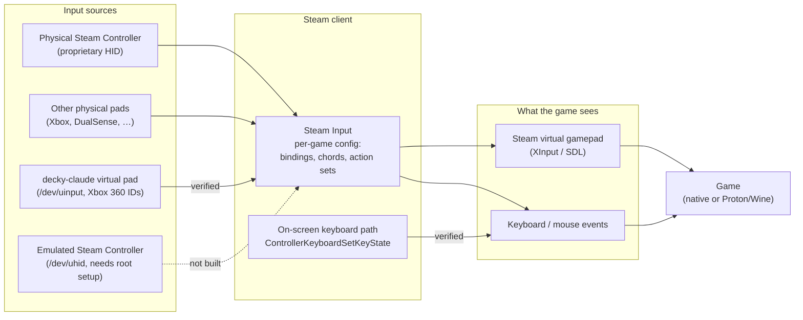

# Game input — findings and plan (parked)

Goal: let Claude operate games itself (e.g. walk through graphics options)
for users who only use a controller, out of the box — no installs, no sudo.
Tested 2026-09-26 on CachyOS + gamescope, Steam Controller (2026), Resident
Evil 5 (appid 21690) under Proton.

## How controller input reaches a game

A game never talks to your physical controller. Every frame it polls a
*virtual* gamepad for its state (which buttons are down, stick and trigger
values). Steam Input owns that virtual pad: it reads the real devices, applies
your per-game controller config (bindings, chords, action sets), and writes the
result to the virtual pad, keyboard or mouse the game sees.

So "sending the same signals as the physical controller" means **becoming a
device Steam reads**. Steam then treats it like any controller and the game
cannot tell the difference.

- **Virtual pad (uinput):** Steam adopts it like a real Xbox pad and applies the
  running game's config. No root: Steam's `60-steam-input.rules` grants the
  logged-in user `/dev/uinput`.
- **Emulated Steam Controller (uhid):** would appear to Steam as an actual
  Steam Controller (trackpads, gyro, Steam button). Needs a one-time udev rule
  for `/dev/uhid` and a reimplementation of its HID protocol, so only worth it
  if a game rejects the Xbox pad.
- **Keyboard path:** the same injection Steam's on-screen keyboard uses; keys
  only, no gamepad buttons or mouse clicks.
- Valve's Steamworks *Steam Input API* (`ISteamInput`) is the **game** side —
  a game asking Steam which actions are active. It is not a way for outside
  programs to send input, which is why the device route above is needed.

## Verified

**Keyboard via Steam's own API (no tools, no root).**
`SteamClient.Input.ControllerKeyboardSetKeyState(hidCode, down)` — the path
Steam's on-screen keyboard uses — reaches the focused game. Codes are USB HID
usages (Enter 40, Esc 41, arrows Right 79 / Left 80 / Down 81 / Up 82).
Also available: `ControllerKeyboardSendText(text)`, `SetMousePosition(...)`.
No click function exists. Verified: Enter passed RE5's "press any key", Down
moved its menu highlight.

**Virtual controller via uinput (no tools, no root).**
`60-steam-input.rules` (shipped with Steam) grants the logged-in user
`/dev/uinput`, so a stdlib-only script can create an Xbox 360 pad
(`scripts/prototypes/virtual_pad.py`). Steam adopts it as a Steam Input
device (`~/.steam/steam/logs/controller.txt`: "Steam controller device
opened", XInput slot reserved, the game's own config set activated), so it
goes through Steam Input with the user's per-game config. Verified: in RE5
Start opened the main menu, the D-pad navigated it, and the game announced
"Control scheme changed to controller".

## Quirks found

- Steam's JS API has **no** function to press gamepad buttons —
  `ControllerKeyboardSetKeyState` is keyboard only.
- `SteamClient.Input.SwapControllerOrder` had no visible effect on slot order.
- RE5 only picked the pad up when it was connected before a screen load
  (connected mid-menu: every input ignored). Likely an old-game hot-plug
  quirk → create the pad at session start, before games launch, and keep it
  for the whole session instead of per command.
- Tap length matters: ~0.1–0.25 s. A 0.5 s hold triggered menu auto-repeat.
- The first input right after connecting may be dropped.
- RE5's title screen accepts Start on a controller, not A.
- Never test while the user is also moving mouse/controller — results become
  ambiguous.

## Not done

- Test the pad as player 2 (real controller connected, pad in XInput slot 1).
- Emulating a real Steam Controller: needs `/dev/uhid` (root-only by default →
  one-time udev rule) plus reimplementing its HID protocol. Only worth it if a
  game rejects the Xbox pad.

## Planned design

1. Default: keyboard/mouse (Steam API for keys/text; mouse clicks optional).
2. Fallback: persistent virtual controller, created at session start.
3. Optional (advanced, one-time setup): emulated Steam Controller.
4. Choose per game from: Valve's Deck compatibility report (controller /
   keyboard-glyph results), Steam store controller-support field, and
   PCGamingWiki's API — plus a small repo table of verified overrides that
   agents extend (e.g. RE5: live KB/controller switching; Start at title).
5. Remove the panel's Manual Input section and `scripts/setup-input-tools.sh`
   once the MCP input tools use the paths above.
