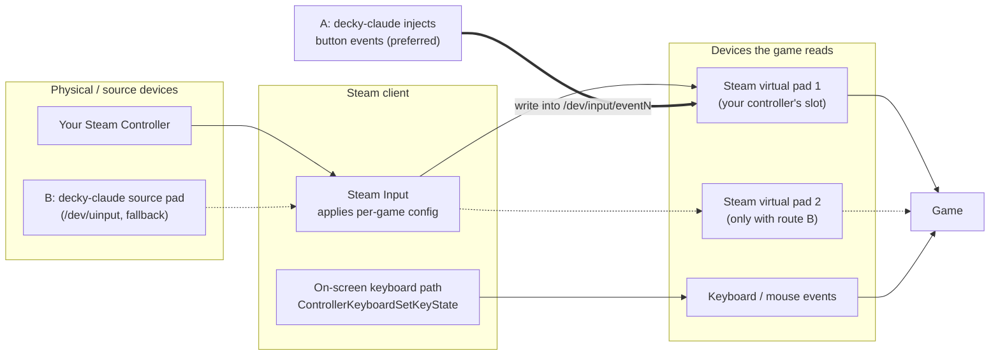

# Game input — findings and plan (parked)

Goal: let Claude operate games itself (e.g. walk through graphics options)
for users who only use a controller, out of the box — no installs, no sudo.
Tested 2026-09-26 on CachyOS + gamescope, Steam Controller (2026), Resident
Evil 5 (appid 21690) under Proton.

## How controller input reaches a game

A game never reads your physical controller. Every frame it polls a
**virtual gamepad** for its current state — which buttons are down, where the
sticks and triggers are. Steam creates that virtual gamepad (one per connected
controller: `Microsoft X-Box 360 pad N`, USB IDs `28de:11ff`, a normal Linux
input device under `/dev/input/`). Steam Input fills it: it reads your real
controller, applies your per-game config (bindings, chords, action sets) and
writes the result into the virtual pad.

That gives two ways for decky-claude to press buttons:

- **A — inject into your controller's existing virtual pad (preferred).**
  Write button events straight into Steam's virtual gamepad for your
  controller. The game sees them on *your* controller's slot, exactly as if
  you had pressed the button. No second controller, no player-2 slot.
- **B — add a new source device (fallback).** Create an extra virtual Xbox pad
  via `/dev/uinput`. Steam adopts it as a *separate* controller with its own
  virtual pad and player slot. Needed only when no controller is connected
  (then there is no existing pad to inject into).

No root is needed for either route: Steam's own udev rules
(`60-steam-input.rules`) give the logged-in user write access to Valve-made
input devices (route A) and to `/dev/uinput` (route B).

## Common confusions (and what was actually true)

- **"Steam Input has an API to send button presses."** No. Valve's Steamworks
  *Steam Input API* (`ISteamInput`) is the **game's** side: a game asking Steam
  which actions are active. Outside programs cannot call it to press buttons.
- **"The game listens to my physical controller, so I need to fake that
  controller."** No — the game listens to Steam's virtual pad. Faking the
  physical controller (e.g. emulating a Steam Controller via `/dev/uhid`) is
  possible but pointless for button presses: injecting into the virtual pad
  (route A) produces the same result with far less work.
- **"Creating a virtual pad = sending input as my controller."** Not quite:
  route B makes Steam see an *additional* controller, which games may treat
  as player 2 or ignore when it appears mid-game. Route A doesn't have that
  problem.
- **Steam's JavaScript API** (`SteamClient.Input`) can inject keyboard keys
  (the on-screen keyboard's path) but has no gamepad-button function.
- **Exception:** games built on Valve's Steam Input API read *actions* from
  Steam directly, not the virtual pad — route A likely won't reach them
  (untested); route B still does, because Steam processes it like a real
  controller.

## Verified

**Route A — injection into Steam's virtual pad (verified in a game).**
Steam's virtual pads are `Microsoft X-Box 360 pad N` (`28de:11ff`), ACL
`user:oliver:rw-`. With Resident Evil Requiem (appid 3764200) running there
were two, `pad 0` and `pad 1`, both read by the game's `winedevice.exe`.
One D-pad Down written into `pad 0` moved the main-menu highlight and the game
switched its prompts from keyboard ("F Confirm") to controller ("A Confirm").
Also verified: D-pad up, A (opened Options), RB/LB (switched Options tabs),
B (back to main menu). X/Y not pressed — in RE9's Options they are "Reset
All"/"Reset Subcategory". Prototype: `scripts/prototypes/inject_into_steam_pad.py`
(targets `pad 0`).

**Keyboard via Steam's own API (no tools, no root).**
`SteamClient.Input.ControllerKeyboardSetKeyState(hidCode, down)` — the path
Steam's on-screen keyboard uses — reaches the focused game. Codes are USB HID
usages (Enter 40, Esc 41, arrows Right 79 / Left 80 / Down 81 / Up 82).
Also available: `ControllerKeyboardSendText(text)`, `SetMousePosition(...)`.
No click function exists. Verified: Enter passed RE5's "press any key", Down
moved its menu highlight.

**Route B — additional virtual controller via uinput (no tools, no root).**
`scripts/prototypes/virtual_pad.py` creates an Xbox 360 pad. Steam adopts it
as a Steam Input device (`~/.steam/steam/logs/controller.txt`: "Steam
controller device opened", XInput slot reserved, the game's own config set
activated). Verified once in RE5: Start opened the main menu, the D-pad
navigated it, and the game announced "Control scheme changed to controller".

## Quirks found

- `SteamClient.Input.SwapControllerOrder` had no visible effect on slot order.
- Route B in RE5: inputs were ignored when the pad was connected mid-menu;
  the one success had it connected before a screen load. Possibly an old-game
  hot-plug quirk — not conclusively determined.
- Tap length matters: ~0.1–0.25 s. A 0.5 s hold triggered menu auto-repeat.
- The first input right after connecting a new pad may be dropped.
- RE5's title screen accepts Start on a controller, not A.
- Steam only writes *changes* to its virtual pad: injecting a press while the
  user holds the same button can produce an early release in the game.
- Never test while the user is also moving mouse/controller — results become
  ambiguous.

## Not done

- Route A: which `pad N` is the user's own when several controllers are
  connected (only `pad 0` was tested).
- Route A against a game using the Steam Input API.
- Route B as player 2 (real controller connected).
- Emulating a real Steam Controller via `/dev/uhid` — likely unnecessary given
  route A.

## Planned design

1. Default: keyboard/mouse (Steam API for keys/text; mouse clicks optional).
2. Controller input: route A (inject into the user's existing Steam virtual
   pad); route B only when no controller is connected, created at session
   start and kept for the session.
3. Choose per game from: Valve's Deck compatibility report (controller /
   keyboard-glyph results), Steam store controller-support field, and
   PCGamingWiki's API — plus a small repo table of verified overrides that
   agents extend (e.g. RE5: live KB/controller switching; Start at title).
4. Remove the panel's Manual Input section and `scripts/setup-input-tools.sh`
   once the MCP input tools use the paths above.
